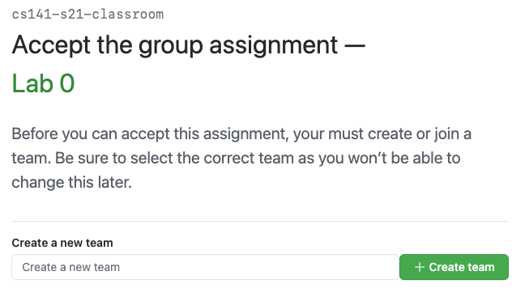
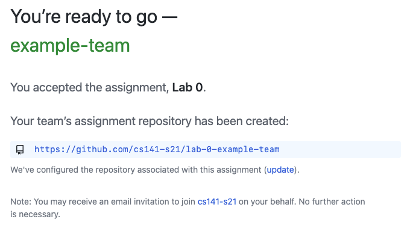
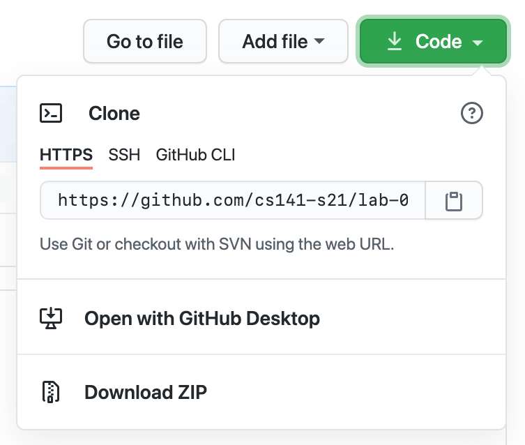
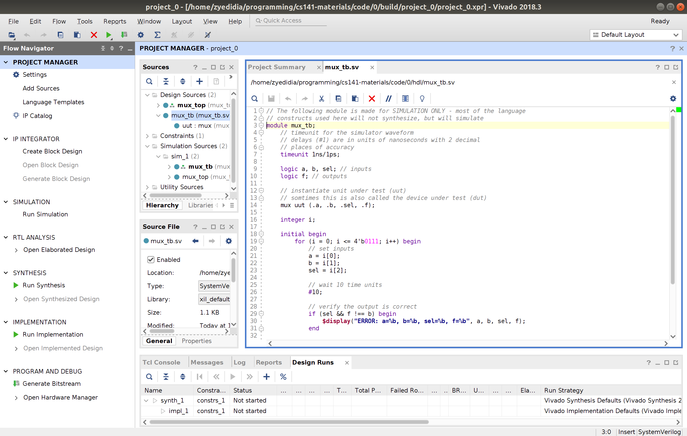
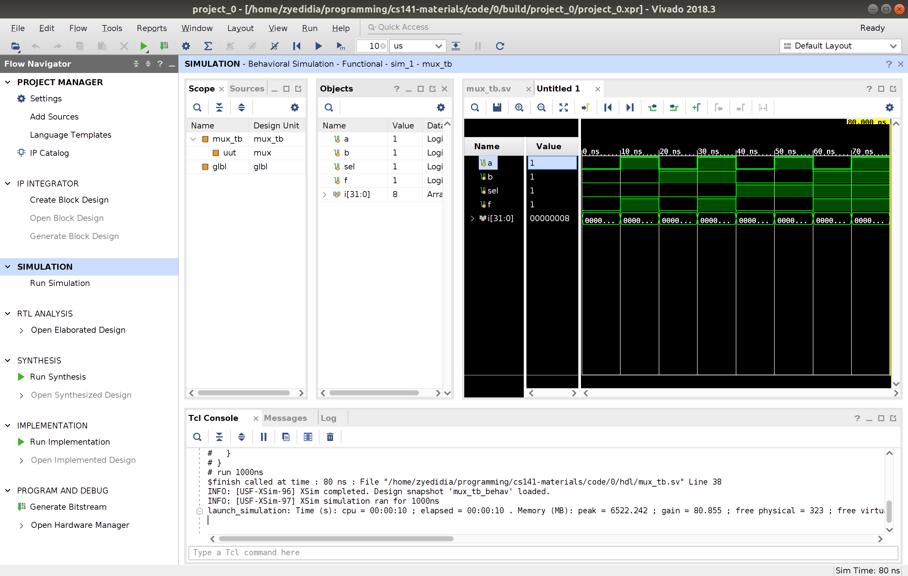
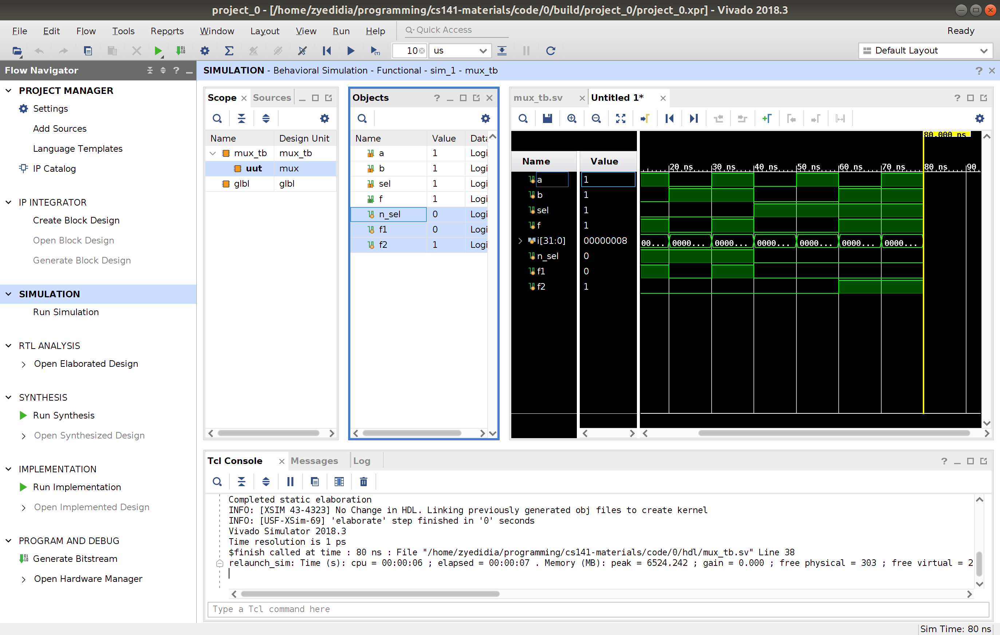
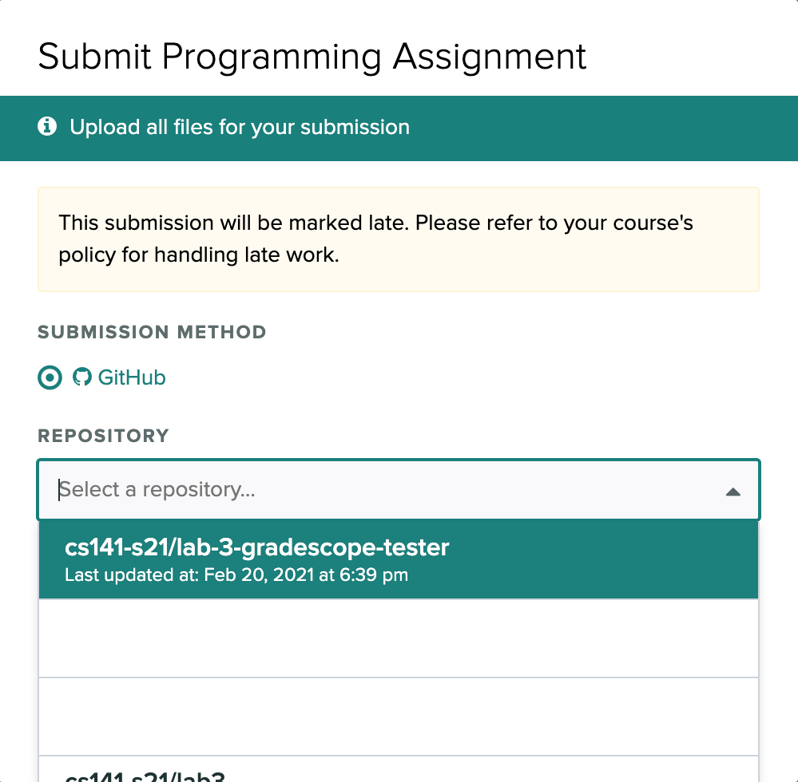
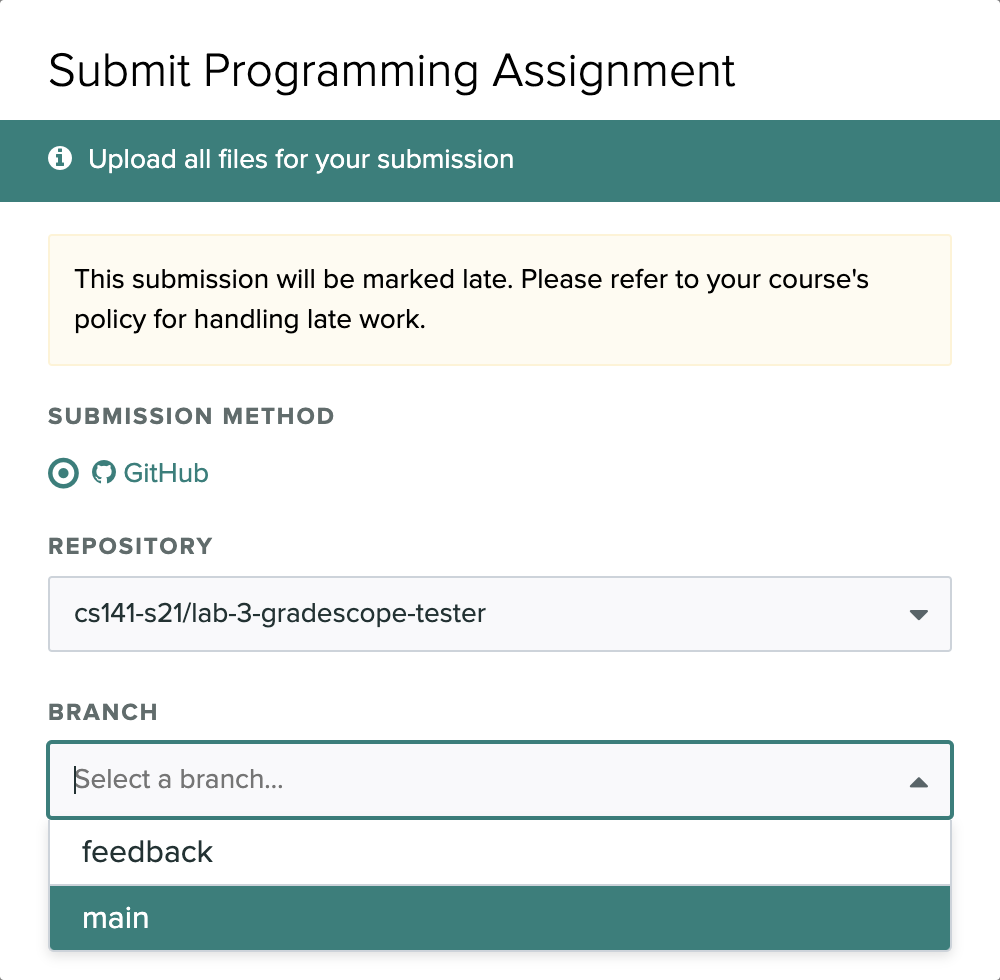
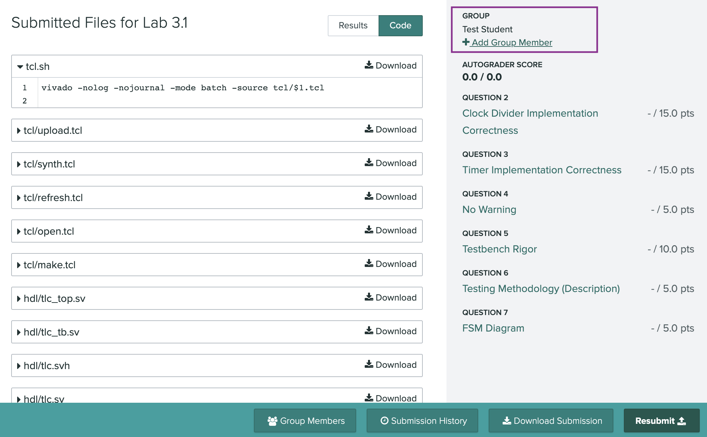

# Lab 0

## Assignment

This is an example assignment. You do not need to submit anything, but
it will show you what you need to know to complete future coding labs.
Through this guide, you will learn the fundamentals for:

  - retrieving lab handout files

  - the structure of a standard project

  - editing HDL code

  - simulating HDL code

  - synthesizing HDL code and uploading to FPGA

  - creating a bitstream file and utilization report for submission

## Retrieving Handout

Please click this [link](https://classroom.github.com/a/K-4mg3gU) to
clone the Lab 0 handout code repository.

The link will ask you to log in and then first join our classroom, 
it's okay if you don't find your name, just click "Skip to the next step."  
Then you'll link be prompted to create or join a team. **Don’t worry\!**
There’s no submission for Lab 0, so you can arbitrarily pair up or
just create your own single-person team.



Then you’ll be able to accept the assignment, after which point GitHub
classroom will make a private clone of the handout repository. For
instance, if your team name was example-team, after a few minutes you
should get a repository called `cs141-s21/lab-0-example-team`.



Download that newly created private repository onto your computer, do
work there, and then push your work upstream to the GitHub-hosted
repository for us to grade (we’ll grade your last commit to your `main`
branch).



**To recap, here’s how it should work:**  

1.  Click the [link](https://classroom.github.com/a/K-4mg3gU).

2.  Log in to GitHub, or create an account.

3.  Create or join a team name.

4.  When you’ve joined a team and accepted the assignment, GitHub
    Classroom will provide you a link to your private repository.

5.  Use the green `Code` download button to clone your repository
    locally.

See the Git and GitHub Guide for further hints and tips.

## Project structure

Vivado is very useful because it provides an integrated development
environment for working on a SystemVerilog project, simulating the code,
synthesizing and uploading to the FPGA—all with a fairly intuitive GUI.
However, it is notoriously difficult to use with version control. Vivado
supports two design flows

1.  *Project mode*: Vivado controls the project files, automatically
    creates reports during synthesis, displays simulation results
    easily, and provides the flow navigator window which allows the
    programmer to easily switch between synthesis, simulation, and the
    hardware manager for programming the board. Unfortunately since
    Vivado controls the files, it is difficult to set up version control
    for this mode.

2.  *Non-project mode*: Vivado commands for synthesis, simulation, and
    programming are executed via Tcl manually at the command line. This
    gives the programmer full control over the files and allows for
    direct access to the project files and easy version control.
    However, everything must be done manually which can be difficult and
    warnings and errors are hard to spot at the command line. Logic
    simulation is especially difficult to run from the command line, and
    Vivado must be booted up on every simulation run.

We will attempt to use **the best of both worlds** by using Tcl scripts
to generate projects on demand from SystemVerilog files in version
control. The projects can be placed in the `.gitignore` and regenerated
when the repository is cloned. Synthesis and simulation can be accessed
from inside project mode and the files can be edited in the Vivado IDE
or in another text editor. A project will contain the following files

  - The `constraint` directory contains a `.xdc` file which is the
    constraint file for the project—informing the “software” what
    physical pins on the FPGA to use in relation to the HDL code you’ve
    written.

  - The `hdl` directory contains all of the SystemVerilog source files
    (“hdl” \(\implies\) hardware description language)

  - The `tcl` directory contains our given Tcl scripts for generating,
    refreshing, and opening the Vivado project associated with the rest
    of the source code.
    
      - `make.tcl`: generates the Vivado project in the `build`
        directory and adds all HDL and constraint files as relative
        files (source files are not copied into the project).
    
      - `refresh.tcl`: refreshes the project files if any new
        SystemVerilog files are added to the `hdl` directory.
    
      - `open.tcl`: opens the project with the Vivado IDE.
    
      - `synth.tcl`: synthesizes the design from the command line and
        creates a bitstream and utilization report. These files are
        placed in `synth\_output/`.
    
      - `upload.tcl`: uploads the bitstream in `synth\_output/`
        (generated by `synth.tcl`) to the FPGA device.

  - `tcl.sh` a Bash script which will run the corresponding Tcl scripts
    with Vivado in batch Tcl mode. It must be provided one argument,
    which is the name of the Tcl script to run (without the extension).
    For example `./tcl.sh make` will run the `make.tcl` script.

In this example lab, the multiplexer (or “mux”) project has the
following structure:

``` 
    constraint/
        Nexys_A7.xdc
    hdl/
        mux_top.sv
        mux.sv
        mux_tb.sv
    tcl/
        make.tcl
        open.tcl
        refresh.tcl
        synth.tcl
        upload.tcl
    tcl.sh
    build/ 
        ...
        # This directory is created by running ./tcl.sh make
```

The `build/` directory (and the `.Xil/` directory) should be placed in
the `.gitignore` for the repository (we do this for you). All other
files can be committed to Git.

Files can be edited at the command line or in Vivado. Once a project is
generated it can be opened with `./tcl.sh open` and from there can be
simulated, synthesized, or uploaded to the FPGA dev board. If you would
like to delete the project simply delete the `build/` directory.

## Editing code with Vivado

After initially pulling the lab, you should see a structure like the one
shown above for the mux project (without the `build/` directory). You
may choose to edit the HDL source files with a text editor rather than
Vivado, though the following instructions will be useful in any case as
Vivado is necessary for simulating. To create a Vivado project run the
`tcl.sh` script at the command line

    ./tcl.sh make

That command should generate a `build/` directory containing a Xilinx
Vivado project in which the generated files are linked to the files in
the `hdl` folder (and the constraint file). Now that the project is
created you will not need to run the `make` script again. If you ever
manually (i.e., not through Vivado) create new files in the `hdl`
directory, add them to the project using the `refresh` script by running
`./tcl.sh refresh`. You can also remove the `build` folder and
regenerate the project with the `make` script. To remove files from the
project delete them from inside Vivado and then remove them from `hdl/`
using the command line.

To open the project run

    ./tcl.sh open

Vivado will open in the background (it can be quite slow so give it
time) and you should see the following:



In the sources panel you should see two folders: “Design Sources” and
“Simulation Sources.” These should contain the same SystemVerilog
files; however, you will want their top modules to be different. The top
module is the module denoted by the **bolded** file. In the picture
above, `mux\_top` is the top module for design and `mux\_tb` is the top
module for simulation. This is correct since `*\_top` should be used for
synthesis (“Design Sources”) and `*\_tb` should be used for simulation
(when you click “Simulate” the top module in “Simulation Sources” will
be run).

It is likely (for other projects) that the **incorrect files are the top
modules** when you first open the project. To fix this right click the
file you want to be the top module and select the “Set as Top” option.

We will try our best to select the correct top modules in our `make` and
`refresh` Tcl scripts, but as your projects grow, you may need to
self-manage the top files. Wrongly chosen files may cause synthesis or
simulation to fail.

Double-click files in the sources panel to open them in the built-in
editor in Vivado. Errors and warnings should be shown in the editor as
you type or displayed in the console at the bottom of the screen.

## Simulation

To run simulation, click on “Run Simulation” in the flow navigator on
the left side. Choose “Run Behavioral Simulation.” This will simulate
your design for 10 microseconds or until a `\$finish` statement is
reached in the testbench (the `mux\_tb.sv` file). If a `\$finish`
statement is reached, the code and line where it is located will be
shown. Otherwise, a waveform at the current time will be displayed. Any
messages that were displayed using `\$display` or `\$monitor` will be
shown in the console at the bottom of the screen. Hopefully, you don’t
see any errors displayed in the console for our example project.

To **view the waveform** after a `\$finish` statement has been reached
or the simulation has timed out, move to the “Untitled” tab. Select
“Zoom fit” to fit the entire waveform to the view.



You can also select a specific signal in the waveform viewer (such as
`a` which is selected in the picture) and press the arrow keys to
navigate to every place where that signal changes. Notice that we are
only able to view signals that are exposed to the testbench. The
internal mux signals `f1`, `f2`, and `n\_sel` are not viewable by
default.

To view **internal signals**, select the module to inspect from the
“Scope” panel on the left. We want to view signals internal to `uut`
(here is where module instantiation names are useful) so select it after
dropping down the `mux\_tb` topfile. In the “Objects” panel you should
now see the internal signals. To view them in the waveform viewer select
them and drag them to the right. Then click “Relaunch simulation” which
is the rightmost option in the upper toolbar (it is an arrow pointing
clockwise in a circle). The waveform should then be populated with the
selected internal signals.



As your projects grow in complexity, you may want to save waveform
configurations for easy debugging through simulation (rather than
finding the signals of interest, moving them into the waveform viewer,
and relaunching every time you reopen your project). You can save a
configuration for easy reuse by navigating to `File->Simulation
Waveform->Save Configuration`.

Feel free to play around and get used to the different options. You can
also close the “Scopes” and “Objects” panels to give more space for the
waveform. You can always get them back by navigating to `Layout->Default
Layout`. You may close the simulator via the `X` in the shaded blue bar
when you are done, or you can leave the simulator open and click
“Relaunch simulation” (from the upper toolbar) every time you change
your SystemVerilog code and want to re-simulate.

## Synthesis and uploading to the FPGA via Vivado GUI

To synthesize your design via the Vivado GUI, click “Generate Bitstream”
in the flow navigator. This will probably ask you to run synthesis and
implementation as well and you should select `Yes`.

In Vivado **synthesis** has a very specific meaning within the overall
chip creation steps. Generally, by “synthesis” we imply the
transformation of code into hardware, but for Vivado “synthesis” means
specifically turning the SystemVerilog code into a list of logic gates.
Then Vivado must perform many more steps to actually turn the list of
logic gates into hardware (the logic gates need to be placed into
certain logic cells and the wires between them routed correctly).
Finally the bitstream must be generated which can be uploaded to the
FPGA to actually set up the design in hardware.

Generating the bitstream (and running all the previous steps) should
take a few minutes and you can track progress in the console area under
“Design Runs” or in the top right corner of Vivado. Opening the
“Project Summary” tab will also show various reports about how the
design was synthesized.

Once the bitstream is generated, you can upload to the FPGA in the
Vivado GUI via the hardware manager. Make sure that the FPGA is
connected by USB to your computer (you should plug the cable into the
“Prog/UART” microUSB slot on the board and ensure the device is passed
to the Linux VM) and switched on. Click “Open Hardware Manager” and
select “Open Target” and then “Auto Connect.” Then you can click
“Program Device” and the design should be viewable on the board.

## Synthesis with Tcl scripts

In the `tcl` directory we also provide Tcl scripts for synthesizing and
uploading the bitstream at the command line. The synthesis script can
also be edited to generate timing, power, and utilization reports (by
default it only generates a utilization report). These scripts are
called `synth.tcl` and `upload.tcl`. The `synth.tcl` script will
generate an additional directory called `synth\_output` which will
contain the generated bitstream and any reports or design checkpoints
that were created. These Tcl scripts can be run with the `tcl.sh` Bash
script. Start with

    ./tcl.sh synth

After running this command you should see `mux.bit` and
`post\_route\_util.rpt` in the `synth\_output` folder.

Then, to upload to your board, make sure it’s on and connected to your
Linux VM, and run

    ./tcl.sh upload

Note that the `upload.tcl` script requires that the bitstream be located
in `synth\_output/` so make sure that you ran synthesis using
`synth.tcl` and not in the Vivado IDE.

## Summary

  - To generate the project run `./tcl.sh make`. Then open it with
    `./tcl.sh open`. You can refresh the files with `./tcl.sh refresh`
    or you can delete the `build` folder and re-make. Feel free to edit
    the files in the `hdl` folder with your own text editor.

  - To simulate, make sure the correct file is selected as your
    simulation top module and click “Run Behavioral Simulation.”

  - To synthesize press “Generate Bitstream,” and wait 1-2 minutes.

  - To upload to the FPGA click “Open Hardware Manager,” then click
    “Auto Connect” and then “Program Device.” Of course, the FPGA
    should be connected to the Linux VM and powered on.

  - To generate a bitstream and utilization report for lab submission
    run `./tcl.sh synth`. The output will be contained in the
    `synth\_output` directory.

## Submission

There is nothing for your to submit for this lab. However, usually we
will require the following files to be pushed to your assignment
repository’s main branch (ideally before the lab deadline) in the given
structure:

    project_0/
        constraint/
            Nexys_A7.xdc
        hdl/
            *.sv
        tcl/
            *.tcl
        synth_output/
            mux.bit
            post_route_util.rpt

Occasionally, we will also ask for sketches of your circuitry or
descriptions of your testing methodology.

## Gradescope

To complete your submission, one person in your lab team must submit the
assignment by pulling the latest commit on Gradescope. To do so, find
the relevant assignment on Gradescope and select your team’s GitHub
repository (as auto-generated by GitHub Classroom when you first
accepted the assignment).



Choose the branch which you’d like to submit (at the time of submission,
Gradescope takes a snapshot of the latest commit on that branch—it does
not auto-update after, so you can resume editing on and committing to
that branch without affecting your submission). Ideally, you’ll select
your `main` branch, as we intend for your final work to reside there.



When the selected branch (and it’s most recent commit) from your
repository has been loaded into Gradescope, you should be able to
navigate through your code submission (various files listed). We’ll
place in-line comments here when grading.  
Finally, you may need to add your lab partner to your submission. To do
so, view your submission, and find the `+Add Group Member` link on the
right-hand-side pane. You can then select your lab partner from the
course roster, or manually type their name.



> **Reminder:** as you update your repository, the changes do not
automatically move to Gradescope. When you originally submitted, you
took a snapshot of that moment in time.

**You need to manually resubmit each time.** This provides a benefit of
using one repository for multiple assignments (i.e., multi-part labs
with separate deliverables) as you can continue working in a repository
without affecting your prior submission.

> We recommend that you try submitting some files in this lab via
Gradescope just for a stress-free trial of the submission procedure. An
ungraded assignment is open on Gradescope.


##### Updated 1/6/22, Dhilan Ramaprasad

